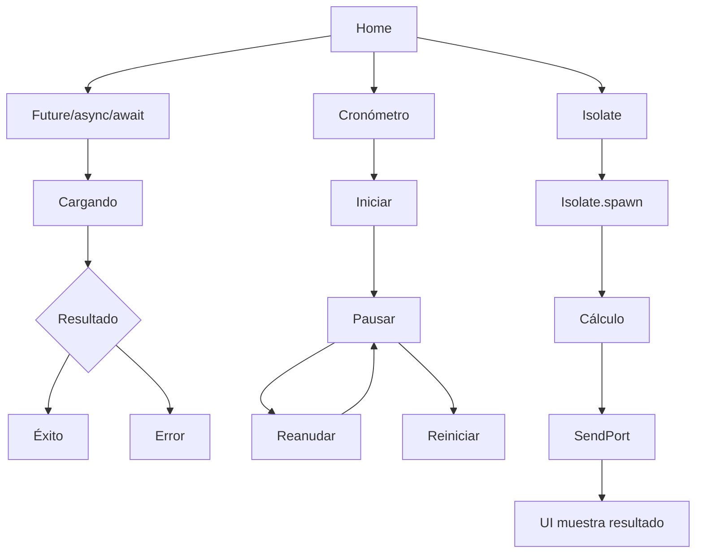

# Taller Segundo Plano en Flutter

Demostración de asincronía en Flutter sin bloquear la UI.

## ¿Cuándo usar cada herramienta?

| Herramienta | Cuándo usarla | Ejemplo en el proyecto |
|---|---|---|
| **Future** | Representa un valor que estará disponible más adelante (E/S: red, archivos, BD). | `DatosService.consultarDatos()` |
| **async/await** | Sintaxis para esperar un Future con código secuencial y legible, sin bloquear la UI. | `FutureScreen._cargar()` |
| **Timer** | Ejecutar código periódicamente o tras un retraso (cronómetros, reintentos, polling). Corre en el mismo hilo. | `CronometroScreen` |
| **Isolate** | Tareas CPU-bound pesadas (cálculos, procesar imágenes, parsear JSON grande). Hilo aparte con memoria propia; se comunica por mensajes. | `IsolateService` |

**Regla práctica:** si solo *esperas* algo (red, disco) usa Future/async. Si *calculas* mucho usa Isolate.

## Pantallas y flujos

1. **Home**: menú con 3 opciones.
2. **Future/async/await**: Inicial → Cargando (2-3 s) → Éxito | Error.
3. **Cronómetro**: Iniciar → Pausar → Reanudar → Reiniciar. El Timer se cancela al pausar y en `dispose()`.
4. **Isolate**: botón → `Isolate.spawn` → cálculo → `SendPort.send` → la UI muestra resultado y tiempo.

### Diagrama



## Estructura

```
lib/
├── main.dart
├── services/
│   ├── datos_service.dart
│   └── isolate_service.dart
└── views/segundo_plano/
    ├── home_screen.dart
    ├── future_screen.dart
    ├── cronometro_screen.dart
    └── isolate_screen.dart
```

## Ejecución

```bash
flutter pub get
flutter run -d windows
```

> Nota: en Flutter Web `Isolate.spawn` no ofrece paralelismo real; usar escritorio o Android.